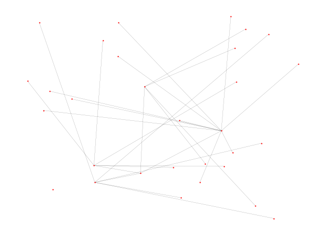
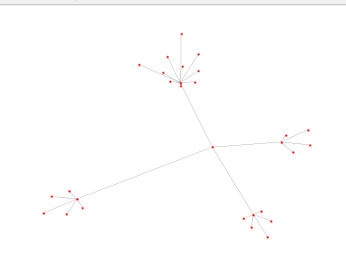
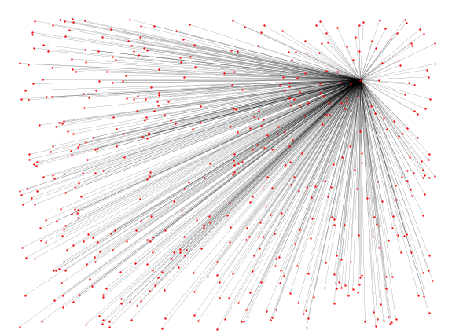
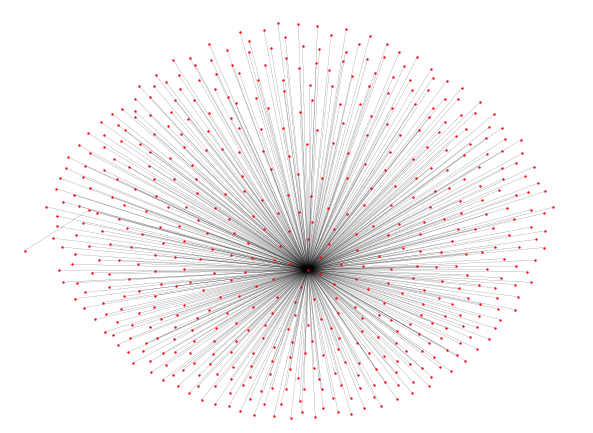
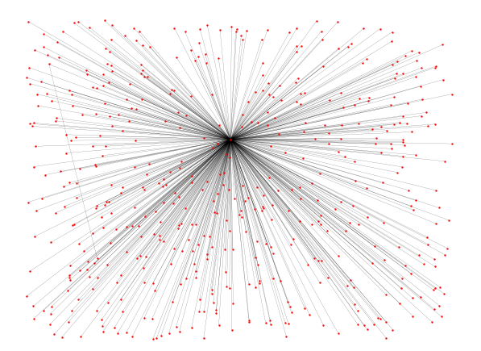
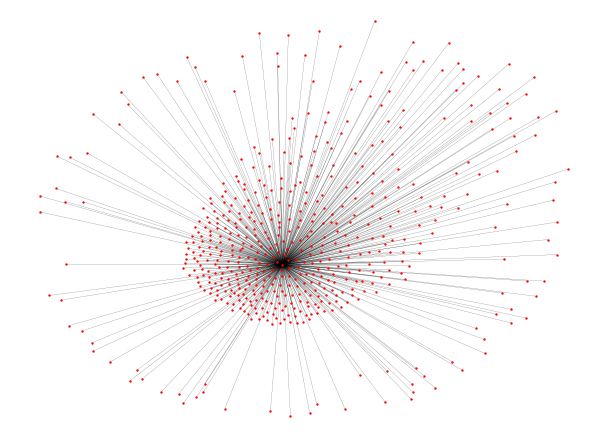

# YifanHu_python
(Barnes_Hut算法)Quadtree和YifanHu layout的python实现 

**Implementation of the YifanHu Layout for representation of huge social network in Python3.5**

It is based on the article of [Efficient, High-Quality
Force-Directed Graph
Drawing](http://www.mathematica-journal.com/issue/v10i1/contents/graph_draw/graph_draw.pdf)

### The visualization and description are available in this project.You can also take a look at [my blog](https://yikunhaocong.com/)

## USAGE
```
from YifanHu import _layout
lo = _layout.YifanHu(graph=g, pos_array=pos)
while not lo.Converged:
	lo.run_layout()
```

# 第一个版本实验：
## s1=1, s2=1
- 运行前随机化坐标

- 生成布局


## s1=10, s2=1
- 运行前随机化坐标

- 生成布局



## s1=1, s2=10
- 运行前随机化坐标

- 生成布局


## Barnes-Hut Visualization
- Insert Nodes 


- Get Mass Centers


### Effectiveness of Model


### Need to optimize
See in my blog: [https://yikunhaocong.com/2018/04/29/barnes-hut/](https://yikunhaocong.com/2018/04/29/barnes-hut/)
